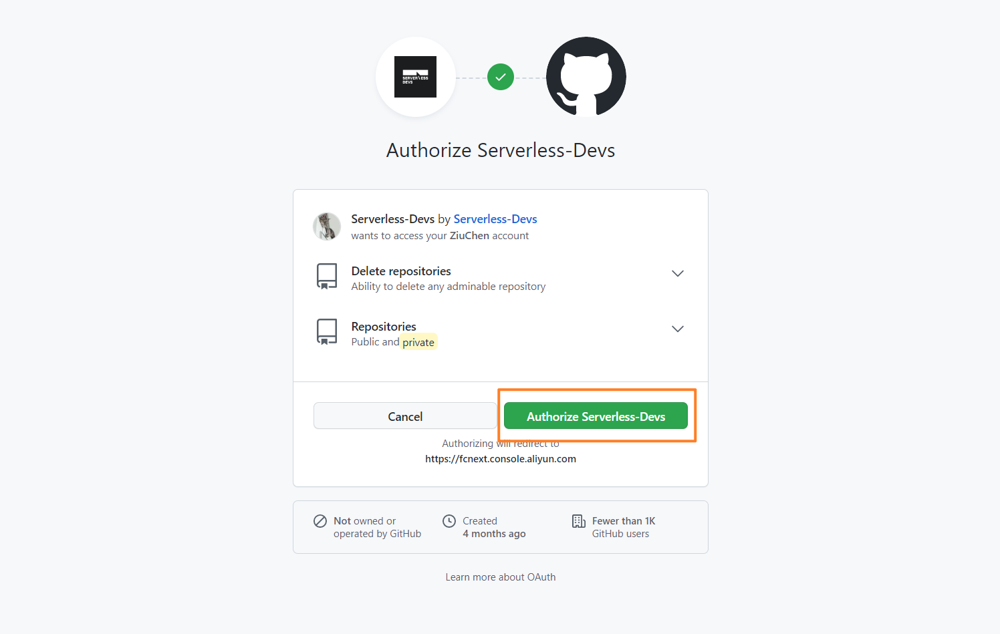
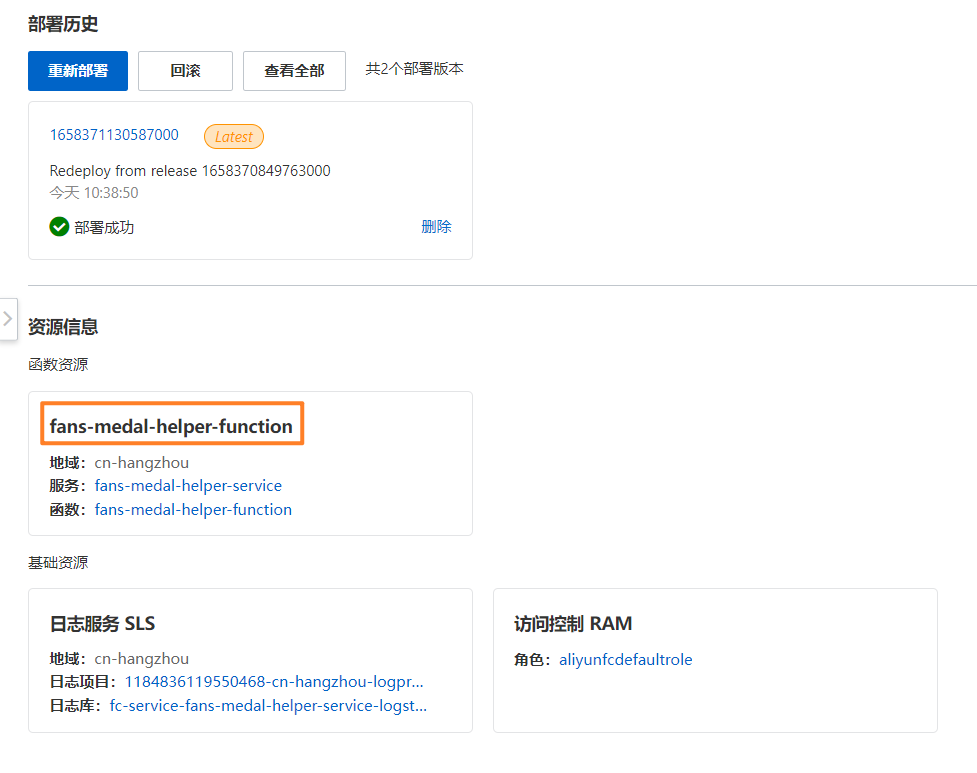

---
sidebar:
    - /guide/
    - /guide/location/
    - /guide/ali-cloud-simple/
    - /guide/ali-cloud/
    - /guide/tx-cloud/
    - /guide/other/
---

# 阿里云计算(函数)部署（0 基础）

## 注册并开通功能

访问[阿里云](https://www.aliyun.com/)官网，注册后完成实名认证，并开通云函数功能。

### 实名认证

`账号中心/实名认证` [链接](https://account.console.aliyun.com/v2/#/authc/home)

### 云函数功能

首先进入[云函数功能首页](https://fcnext.console.aliyun.com/overview)，系统将提示开通功能

### 开通SLS日志服务

访问SLS功能[主页](https://sls.console.aliyun.com/lognext/open)，开通日志服务SLS

## 获取Github授权并Fork仓库

云函数开通完成后，从主页进入`应用/通过仓库导入应用`，按照下图配置应用

支持使用`Github`导入，需提前授权`Github`账号到阿里云

### 授权Github账号

### Fork代码仓库

授权成功后，用授权的账号访问仓库[XiaoMiku01/fansMedalHelper](https://github.com/XiaoMiku01/fansMedalHelper)并点击Fork

## 配置应用

Fork完成后，回到应用配置界面，按下图配置应用

* 仓库名称: `fansMedalHelper`
* 角色名称: 按提示创建
* 高级配置/环境变量
  * 选择`使用表单编辑`，创建一个`USERS`变量，**全为大写**

**USERS的值**：填入的是**最小化**的**JSON格式**的配置文件，详见[配置文件说明](http://localhost:8081/fansMedalHelperVersion/guide/#配置文件说明-users-yaml)

> 如果`仓库名称`中未出现`fansMedalHelper`，可以点击右侧刷新按钮重新获取仓库列表
> 
> 原来使用`users.yaml`的用户需要使用`YAML转JSON工具`转换、最小化后填入

## 创建应用

配置完毕后，点击下方`创建`创建应用

耐心等待初始化、部署等操作完成后，提示部署成功即可。

### 测试函数

完成创建并部署成功后，点击**函数名**，进入函数配置界面

启动测试，到`调用日志/函数日志`，若能看到日志输出，证明已经测试通过。

### 配置触发器

可以在`触发器管理`中配置触发器，以实现每天自动运行。