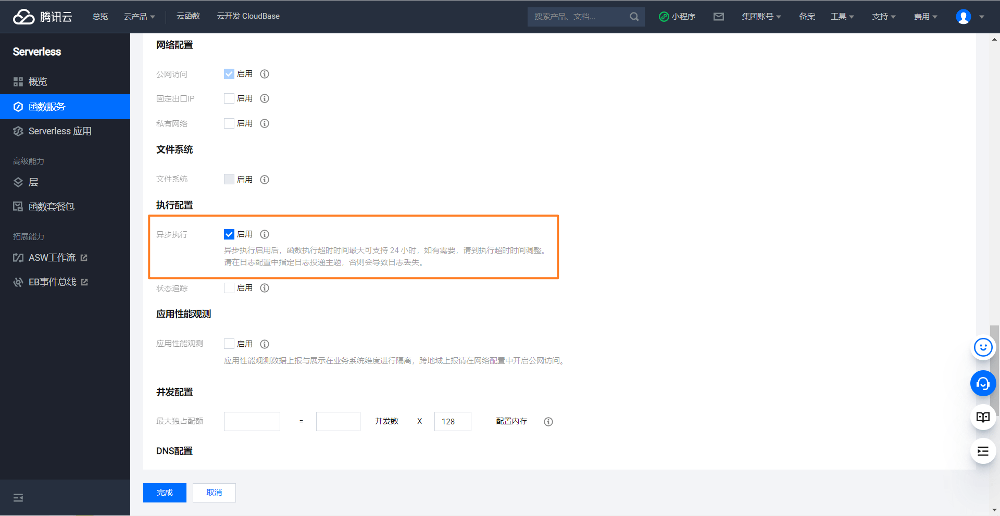

---
sidebar:
    - /guide/
    - /guide/ali-cloud-simple/
    - /guide/ali-cloud/
    - /guide/tx-cloud/
    - /guide/docker/
    - /guide/qinglong/
    - /guide/location/
---

# 腾讯云函数部署

::: warning 注意
在首次开通[腾讯云 SCF 功能](https://cloud.tencent.com/product/scf)的**前三个月可以免费使用**，之后每个月收取*12.8 元*。
:::

## 创建函数并初始化

官网：[腾讯云函数 (SCF)](https://console.cloud.tencent.com/scf/list)

- 登录后点击左侧 **函数服务**，点击 **新建** 按钮
  

- 选择 **从头开始**，函数类型选择 **事件函数**，函数名称随意，地域选择你**购买套餐包的地域**，运行环境选择 **Python 3.7**，时区选择 **Asia/Shanghai**。
​ 

- 函数代码选择 **在线编辑**，其余内容保持默认。
​ 

- 高级配置中，首先勾选执行配置中的 **异步执行**（重要！）。
​ 

- 随后向上翻页，将执行超时时间设为 **86400**（重要！）。
​ 

- 设置触发器，设置为每日 0 时执行一次。
​ 

全部配置完成后，点击最下方按钮 **完成** 并等待函数创建完毕。

## 导入代码并安装依赖

- 函数创建完毕后，点击「函数管理」-「函数代码」，再点击编辑器中的 **终端** - **新终端**。


- 在编辑器下部弹出的 **终端** 中，**依次**输入或粘贴以下代码并按下**回车**，等一行运行完成后再输入下一行。**待终端日志不再更新**，则代码与依赖都已导入完毕。

    ```shell
    rm -rf src && cd src
    git clone https://github.com/XiaoMiku01/fansMedalHelper.git ./
    cp users.example.yaml users.yaml
    python3 -m pip install --upgrade pip
    pip3 install -t . -r requirements.txt
    ```

::: warning 注意

- 如果第二步 `git clone` 出现：
    fatal: unable to access 'https://github.com/XiaoMiku01/fansMedalHelper.git/': OpenSSL SSL_read: Connection was aborted, errno 10053
    说明网络原因拉取失败，请重试第二行命令。

- 若多次失败，可以替换为 `git clone https://ghproxy.com/https://github.com/XiaoMiku01/fansMedalHelper.git ./`
:::

## 部署与测试

在左侧找到 `users.yaml`，修改用户配置，修改完成后保存，点击下方的 **部署**。

​

::: tip 提示
配置文件说明 ：[配置文件](./#配置文件说明-users-yaml)  
由于是云函数触发，配置文件中的 `CRON` 无需填写。
:::

部署成功后，点击**测试**，在下方控制台可查看日志输出，耐心等待运行完毕即可。

## 完毕

设置，测试，运行没有问题后，就可以关闭页面了，之后每天都会在你设置的触发器时间到后自动执行。如果你还设置了微信推送，运行完毕后会收到通知。如果需要保留日志，请在函数配置中开启日志投递（可能会产生费用）。

## 云函数更新方法

:::warning 注意

- 注意你的所使用的云函数！腾讯云函数与阿里云函数的更新方法并不相同！

- 更新完成后，务必点击 **部署** 按钮以保存新代码！
:::

回到 **函数代码** 页面，再次点击 **终端** - **新终端**，并在下方**终端**中粘贴以下代码：

```shell
cd src/ && git pull
```

回车确定后，等待更新完成，再次点击**部署**即可。若出现 `fatal: unable to access` ，就重试 `git pull`。
